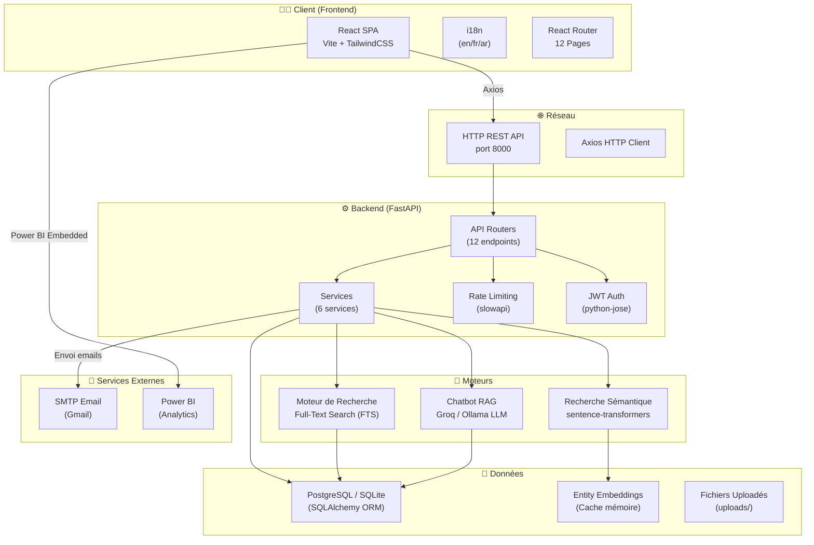
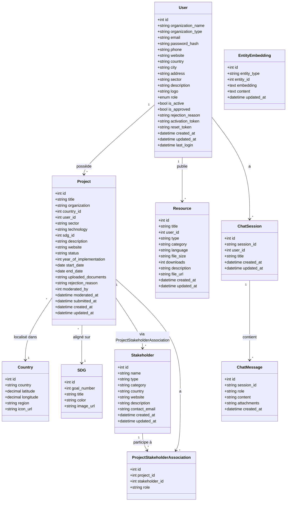
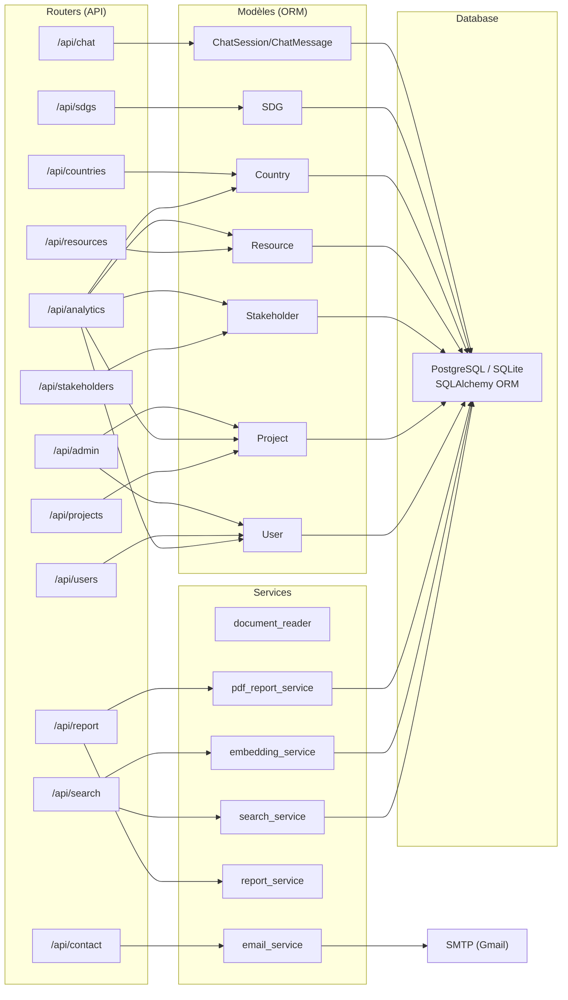
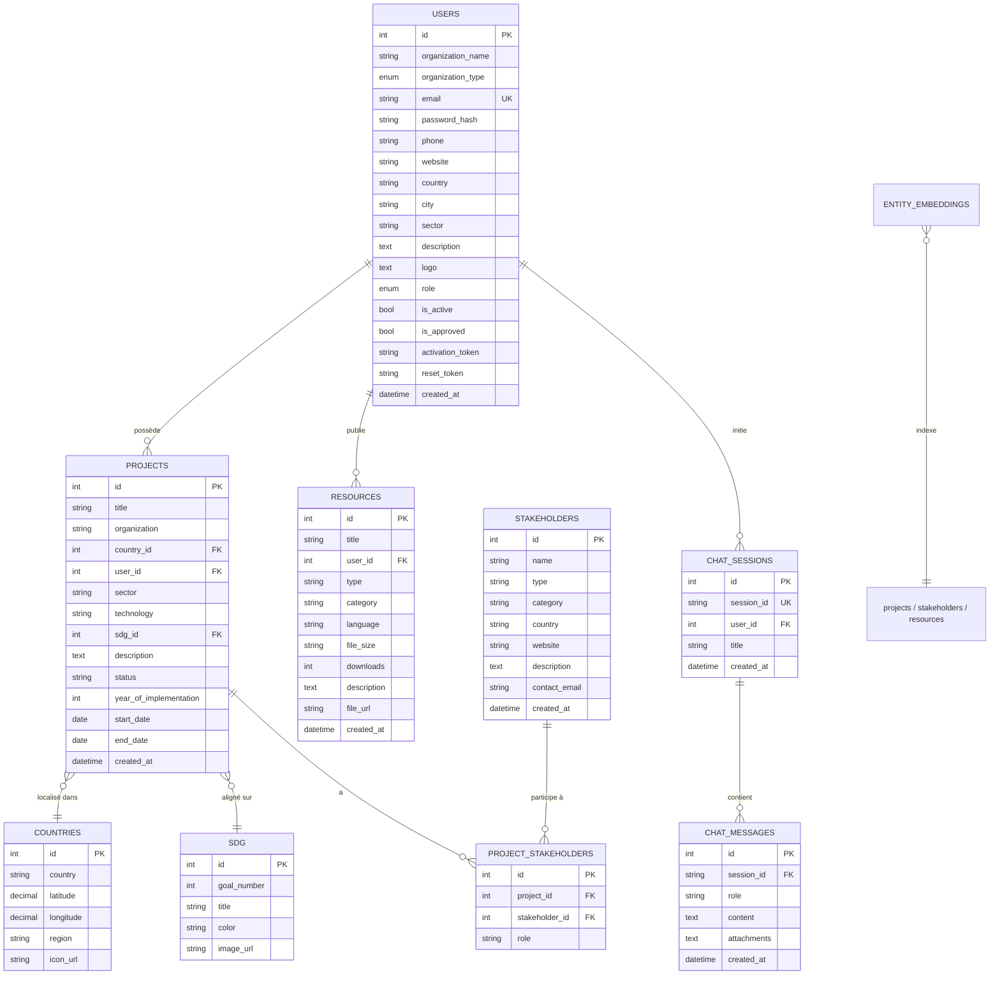
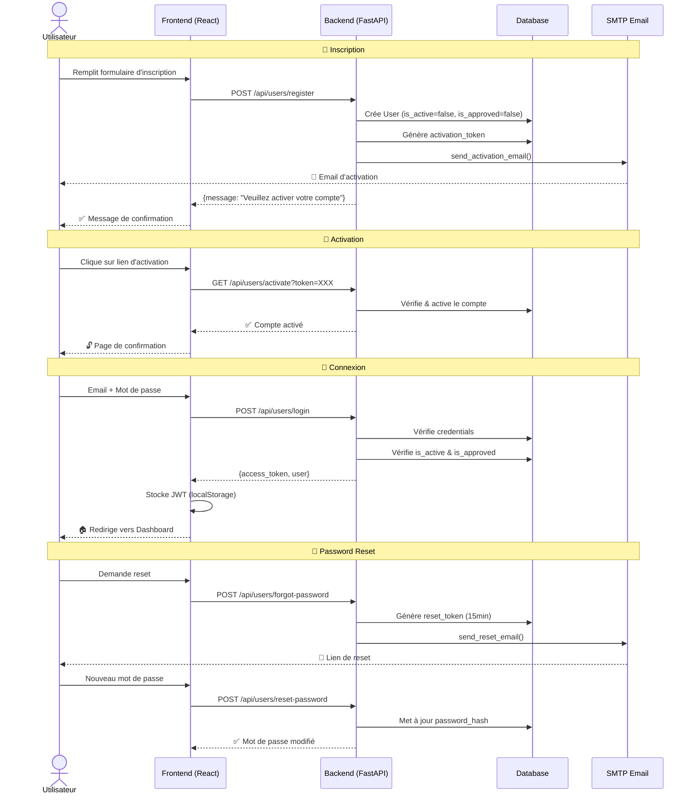
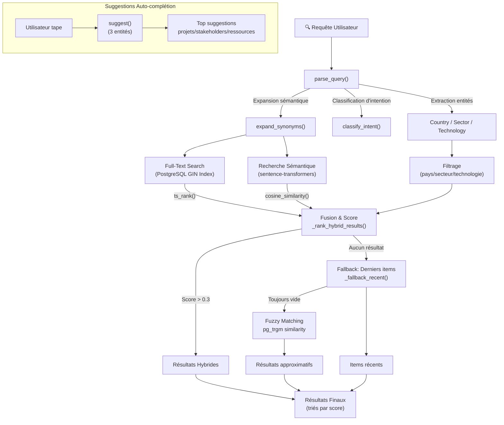
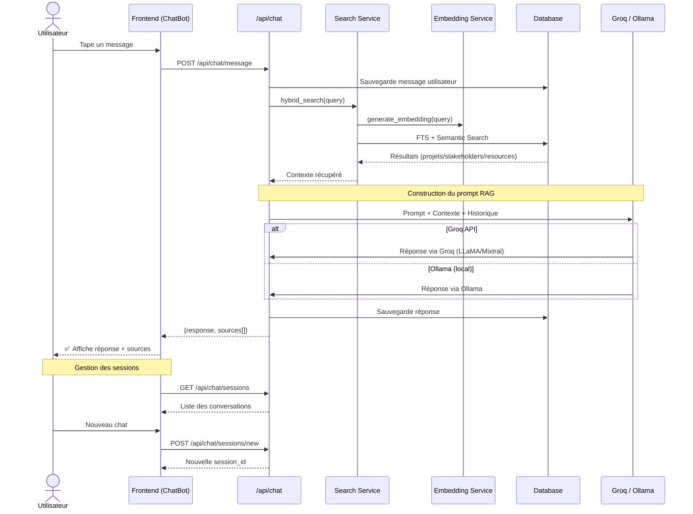
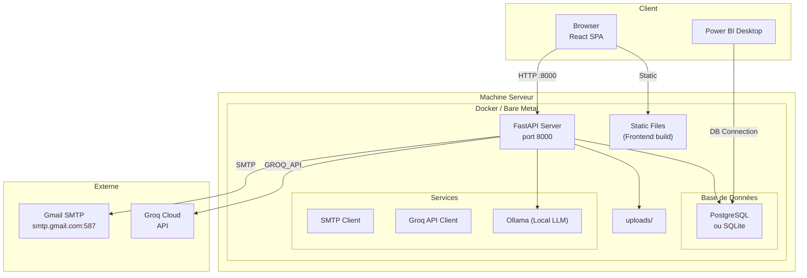

# Diagramme de Conception - SARAI Platform

## Stocktaking of Arab Regional AI Initiatives

---

## 1. Architecture Globale (Vue en Couches)

---

## 2. Diagramme de Classes (Modèle de Données)

---

## 3. Architecture du Frontend (React)

```mermaid
graph TB
    subgraph "App.jsx (Root)"
        ROOT["Router Principal"]
    end

    subgraph "Composants Partagés"
        NAV["Navbar<br/>(Navigation + Auth)"]
        FT["Footer"]
        CHAT["ChatBot<br/>(Floating RAG)"]
        TOUR["UserGuideTour<br/>(Onboarding)"]
        TOAST["ToastContainer<br/>(Notifications)"]
        SB["SearchBar"]
        CARD["Card"]
    end

    subgraph "Pages"
        HOME["Home"]
        SD["StakeholderDirectory"]
        PS["ProjectStocktaking"]
        PD["ProjectDetails"]
        KM["KnowledgeMap"]
        RL["ResourceLibrary"]
        AN["Analytics"]
        PR["Profile"]
        MP["MyProjects"]
        SG["SDGs"]
        SR["SearchResults"]
        AD["AdminDashboard"]
    end

    subgraph "État Global"
        I18N["i18n<br/>(en/fr/ar)"]
        API["config.js<br/>(API_BASE)"]
    end

    ROOT --> NAV
    ROOT --> FT
    ROOT --> CHAT
    ROOT --> TOUR
    ROOT --> TOAST
    ROOT --> HOME
    ROOT --> SD
    ROOT --> PS
    ROOT --> PD
    ROOT --> KM
    ROOT --> RL
    ROOT --> AN
    ROOT --> PR
    ROOT --> MP
    ROOT --> SG
    ROOT --> SR
    ROOT --> AD

    PS --> SB
    PS --> CARD
    SD --> SB
    SD --> CARD
    RL --> SB
    RL --> CARD

    I18N -.->|"utilise"| ALL_COMPONENTS
    API -.->|"Axios requests"| BACKEND
```

---

## 4. Architecture du Backend (FastAPI)

---

## 5. Schéma Relationnel de la Base de Données

---

## 6. Diagramme de Flux - Authentification & Inscription

---

## 7. Pipeline de Recherche Hybride

---

## 8. Architecture du Chatbot RAG

---

## 9. Diagramme de Déploiement

---

## 10. Légende des Technologies

| Couche | Technologie | Rôle |
|--------|------------|------|
| **Frontend** | React 18 + Vite 5 | Framework UI + Build tool |
| **Frontend** | TailwindCSS 4 | Styling utilitaire |
| **Frontend** | React Router DOM 6 | Routing côté client |
| **Frontend** | react-i18next | Internationalisation (en/fr/ar) |
| **Frontend** | Axios | Client HTTP |
| **Backend** | FastAPI | Framework REST API (Python) |
| **Backend** | SQLAlchemy | ORM (Object Relational Mapping) |
| **Backend** | Pydantic | Validation de données (schemas) |
| **Backend** | python-jose | JWT Authentication |
| **Backend** | slowapi | Rate Limiting |
| **Backend** | sentence-transformers | Embeddings sémantiques |
| **Backend** | Groq SDK / Ollama | LLM pour Chatbot RAG |
| **Backend** | fpdf2 | Génération PDF (rapports) |
| **Database** | PostgreSQL (prod) / SQLite (dev) | Base de données |
| **DevOps** | Docker (optionnel) | Conteneurisation |
| **BI** | Power BI | Tableaux de bord analytiques |

---

## 11. Routes API (Endpoints)

### Projets
- `GET /api/projects` - Liste tous les projets
- `GET /api/projects/{id}` - Détail d'un projet
- `POST /api/projects` - Créer un projet
- `PUT /api/projects/{id}` - Modifier un projet
- `DELETE /api/projects/{id}` - Supprimer un projet

### Utilisateurs
- `POST /api/users/register` - Inscription
- `POST /api/users/login` - Connexion
- `GET /api/users/me` - Profil connecté
- `PUT /api/users/me` - Modifier profil
- `POST /api/users/forgot-password` - Mot de passe oublié
- `POST /api/users/reset-password` - Réinitialiser mot de passe
- `GET /api/users/activate` - Activer compte

### Recherche
- `GET /api/search` - Recherche hybride (FTS + sémantique)
- `GET /api/search/suggest` - Auto-complétion
- `GET /api/search/reindex` - Reconstruire index

### Chat
- `GET /api/chat/sessions` - Liste sessions
- `POST /api/chat/sessions/new` - Nouvelle session
- `POST /api/chat/message` - Envoyer message (RAG)
- `DELETE /api/chat/sessions/{id}` - Supprimer session

### Admin
- `GET /api/admin/pending-projects` - Projets en attente
- `POST /api/admin/approve-project` - Approuver projet
- `POST /api/admin/reject-project` - Rejeter projet
- `GET /api/admin/users` - Gérer utilisateurs
- `POST /api/admin/approve-user` - Approuver organisation
- `POST /api/admin/reject-user` - Rejeter organisation

### Autres
- `GET/POST/PUT/DELETE /api/stakeholders` - CRUD parties prenantes
- `GET/POST/PUT/DELETE /api/resources` - CRUD ressources
- `GET /api/countries` - Liste pays (22 ligue arabe)
- `GET /api/sdgs` - Objectifs de développement durable
- `GET /api/analytics/*` - Statistiques et métriques
- `POST /api/contact` - Formulaire de contact
- `GET /api/report/download` - Télécharger rapport PDF annuel
